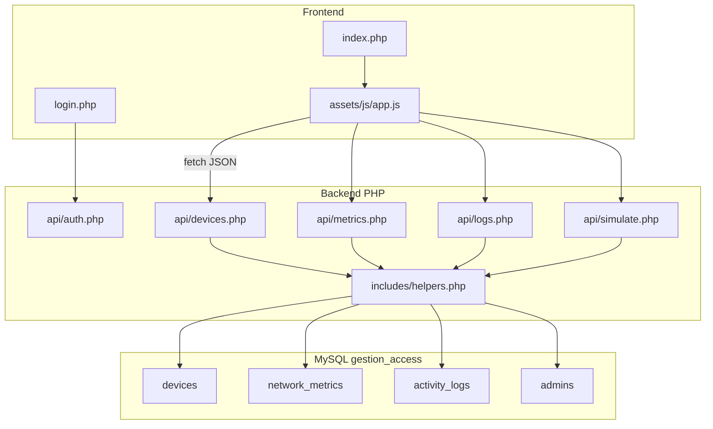

# Gestion_Access — Monitor_Ω

**Sujet L3 :** Système de surveillance de réseau avec tableau de bord  
**Objectif :** Permettre à un administrateur de surveiller en temps réel les performances d'un réseau via un tableau de bord simple et interactif.

Application web **HTML / CSS / JavaScript** (front) + **PHP / MySQL** (back), avec utilisateurs et scénarios **simulés**. Le design reprend le prototype [`Prototype.html`](Prototype.html) (thème sombre, sidebar, cartes métriques, tableau Wi-Fi, timeline, simulations).

---

## Stack technique

| Couche | Technologie |
|--------|-------------|
| Front | HTML5, Tailwind CSS (CDN), JavaScript ES modules |
| Back | PHP 8.x, sessions, PDO |
| BDD | MySQL (`gestion_access`) |
| Serveur local | XAMPP (Apache + MySQL) |
| Polices | Inter, JetBrains Mono, Material Symbols |

---

## Prérequis

- [XAMPP](https://www.apachefriends.org/) (ou équivalent : Apache + PHP 8+ + MySQL)
- Navigateur moderne (Chrome, Firefox, Edge)
- PHP en ligne de commande (optionnel, pour `database/install.php`)

---

## Installation pas à pas

### 1. Copier le projet

Placez le dossier `Gestion_Access` dans le répertoire web de XAMPP :

```
C:\xampp\htdocs\Gestion_Access\
```

### 2. Démarrer XAMPP

- Lancez le **panneau de contrôle XAMPP**
- Démarrez **Apache** et **MySQL**

### 3. Créer la base de données

**Option A — phpMyAdmin**

1. Ouvrez `http://localhost/phpmyadmin`
2. Importez [`database/schema.sql`](database/schema.sql)
3. Importez [`database/seed.sql`](database/seed.sql)

**Option B — Ligne de commande**

```bash
cd C:\xampp\htdocs\Gestion_Access
php database/install.php
```

**Option C — MySQL CLI**

```bash
C:\xampp\mysql\bin\mysql.exe -u root < database/schema.sql
C:\xampp\mysql\bin\mysql.exe -u root < database/seed.sql
```

### 4. Configuration base de données

Fichier [`config/database.php`](config/database.php) — valeurs par défaut XAMPP :

| Paramètre | Valeur |
|-----------|--------|
| Host | `127.0.0.1` |
| Base | `gestion_access` |
| Utilisateur | `root` |
| Mot de passe | *(vide)* |

Modifiez ce fichier si votre installation MySQL utilise un autre mot de passe.

### 5. Accéder à l'application

| Page | URL |
|------|-----|
| Connexion | `http://localhost/Gestion_Access/login.php` |
| Dashboard | `http://localhost/Gestion_Access/index.php` |

---

## Comptes démo

| Identifiant | Mot de passe | Profil |
|-------------|--------------|--------|
| `admin` | `admin123` | Natali Peresta — Admin Level 4 |

---

## Structure des dossiers

```
Gestion_Access/
├── index.php                 # Dashboard SPA (protégé par session)
├── login.php                 # Page de connexion
├── logout.php                # Déconnexion
├── Prototype.html            # Référence design (statique)
├── README.md                 # Ce fichier
├── config/
│   └── database.php          # Connexion PDO MySQL
├── includes/
│   ├── session.php           # Gestion sessions PHP
│   ├── auth_guard.php        # Redirection si non connecté
│   ├── helpers.php           # Logique métier partagée
│   └── partials/             # Composants HTML réutilisables
├── api/
│   ├── auth.php              # Authentification JSON
│   ├── devices.php           # Liste / toggle / block appareils
│   ├── metrics.php           # Métriques réseau
│   ├── logs.php              # Timeline d'activité
│   └── simulate.php          # Simulations trafic / intrusion
├── database/
│   ├── schema.sql            # Structure des tables
│   ├── seed.sql              # Données initiales
│   └── install.php           # Script d'installation CLI
└── assets/
    ├── css/dashboard.css     # Styles custom (animations, scrollbar)
    └── js/
        ├── config.js         # URL API, intervalle polling
        ├── api.js            # Appels fetch
        ├── ui.js             # Toasts, badges, icônes
        ├── dashboard.js      # Rendu widgets, tableau, logs
        ├── navigation.js     # Navigation SPA (6 vues)
        └── app.js            # Point d'entrée
```

---

## Architecture



**Flux toggle appareil :** JavaScript `PATCH api/devices.php` → PHP met à jour `devices` → `recalcMetrics()` → `logEvent()` → le front recharge métriques, tableau et logs.

---

## Schéma base de données

### Tables

| Table | Description |
|-------|-------------|
| `admins` | Administrateurs simulés |
| `devices` | Appareils Wi-Fi simulés |
| `network_metrics` | État global du réseau (1 ligne, `id = 1`) |
| `activity_logs` | Journal chronologique (timeline) |
| `traffic_history` | Historique des pics de trafic |

### Relations

- `activity_logs.device_id` → `devices.id` (ON DELETE SET NULL)

### Énumérations

**devices.status** : `authorized` | `inactive` | `blocked` | `guest`  
**devices.device_type** : `laptop` | `mobile` | `desktop` | `unknown`  
**activity_logs.severity** : `info` | `warning` | `error`  
**network_metrics.network_status** : `online` | `degraded` | `offline`

### Données initiales (seed)

**Appareils :**

| Hostname | Type | IP | Statut |
|----------|------|-----|--------|
| AP_Library | desktop | 19.188.10.2 | authorized |
| Laptop_3 | laptop | 19.188.10.22 | authorized |
| Laptop_Sara | mobile | 19.188.10.3 | guest |
| Laptop_Marc | laptop | 19.188.10.15 | authorized |
| Phone_Julie | mobile | 19.188.10.28 | authorized |

**Métriques :** réseau Online, trafic 850 Mbps (up 212 / down 638).

---

## API REST (JSON)

Toutes les routes (sauf login) exigent une **session PHP** active. Sinon : HTTP `401` + `{"error":"Non authentifié"}`.

### `POST api/auth.php?action=login`

**Corps :**
```json
{ "username": "admin", "password": "admin123" }
```

**Réponse 200 :**
```json
{
  "success": true,
  "admin": {
    "id": 1,
    "username": "admin",
    "full_name": "Natali Peresta",
    "role_level": "Admin Level 4",
    "avatar_url": "..."
  }
}
```

**Réponse 401 :** `{"error":"Identifiants invalides"}`

### `GET api/devices.php`

Retourne la liste des appareils.

### `PATCH api/devices.php?id={id}`

**Toggle ON :**
```json
{ "is_online": true }
```

**Toggle OFF :**
```json
{ "is_online": false }
```

**Bloquer :**
```json
{ "action": "block" }
```

**Réponse :** `{"success":true,"device":{...}}`

### `GET api/metrics.php`

```json
{
  "network_status": "online",
  "active_users": 5,
  "laptops_count": 2,
  "mobile_count": 2,
  "traffic_mbps": 850,
  "traffic_up_mbps": 212,
  "traffic_down_mbps": 638,
  "alert_active": false
}
```

### `GET api/logs.php?limit=50`

Tableau d'entrées `{ id, event_time, event_type, message, severity, device_id }`.

### `POST api/simulate.php`

**Pic de trafic :**
```json
{ "type": "traffic" }
```

**Intrusion :**
```json
{ "type": "intrusion" }
```

**Réinitialiser trafic :**
```json
{ "type": "reset_traffic", "value": 850 }
```

---

## Use cases simulés

| ID | Scénario | Étapes | Résultat attendu |
|----|----------|--------|------------------|
| UC-01 | Connexion admin | `login.php` → admin / admin123 | Session créée, redirect dashboard |
| UC-02 | Chargement dashboard | Ouvrir `index.php` | Cartes, tableau et logs chargés depuis l'API |
| UC-03 | Désactiver appareil | Toggle OFF sur Laptop_3 | `status=inactive`, compteur -1, log timeline |
| UC-04 | Réactiver appareil | Toggle ON | `status=authorized`, compteur +1, log |
| UC-05 | Bloquer accès | Clic Block sur Laptop_Sara | `status=blocked`, log error, toast rouge |
| UC-06 | Recherche | Saisir « Library » dans Search | Filtre le tableau (client) |
| UC-07 | Pic de trafic | Trigger Traffic Spike | Trafic 1.2k, log, retour 850 après 3 s |
| UC-08 | Intrusion Wi-Fi | Simulate Intrusion | `alert_active=1`, device Unknown, log ALERT |
| UC-09 | Déconnexion | Admin → Déconnexion | Redirect login, `index.php` inaccessible |

---

## Fonctionnalités front

- **SPA** : 6 vues via la sidebar (Dash, Wifi, Health, Logs, Sims, Admin)
- **Tableau Wi-Fi** : toggle, block, badges colorés (vert / gris / rouge / orange)
- **Recherche** : filtre hostname, IP, MAC
- **Timeline** : logs en temps réel, polling toutes les 3 secondes
- **Simulations** : pic trafic + intrusion avec toasts et bannière d'alerte
- **Persistance** : toutes les actions survivent au rechargement (F5)

---

## Guide de démo (soutenance)

1. Ouvrir `login.php` — se connecter (`admin` / `admin123`)
2. **Dashboard** — présenter la bannière académique et les 3 cartes Network Overview
3. **Wi-Fi** — montrer le tableau, rechercher « Library »
4. **Toggle** — désactiver Laptop_3 (compteur et log mis à jour)
5. **Block** — bloquer Laptop_Sara (badge rouge, log sécurité)
6. **Simulations** — déclencher Traffic Spike puis Simulate Intrusion
7. **F5** — vérifier que les changements sont persistés en base
8. **Admin** — déconnexion

---

## Tests de validation

| Test | Action | Attendu |
|------|--------|---------|
| T1 | F5 après Block | Appareil reste `blocked` |
| T2 | Toggle plusieurs appareils OFF | Compteur cohérent avec BDD |
| T3 | Simulation trafic | Affichage 1.2k puis retour 850 |
| T4 | Simulation intrusion | Bannière alerte + log ALERT |
| T5 | Accès `index.php` sans login | Redirect vers `login.php` |
| T6 | Appel API sans session | HTTP 401 JSON |
| T7 | Recherche « Sara » | Une ligne visible |

**Test connexion BDD (CLI) :**

```bash
php database/test_connection.php
```

Attendu : `auth_ok=yes` et `devices=5`.

---

## Dépannage

| Problème | Solution |
|----------|----------|
| `Erreur base de données` / PDO | Vérifier que MySQL est démarré dans XAMPP |
| Page blanche | Activer `display_errors` dans `php.ini` ou consulter `apache/logs/error.log` |
| `Identifiants invalides` | Réimporter `seed.sql` ou exécuter `php database/install.php` |
| API 401 | Se reconnecter via `login.php` (session expirée) |
| Modules JS ne chargent pas | Utiliser Apache (`localhost/...`), pas `file://` |
| `CORS` / fetch échoue | Servir le projet via `http://localhost/Gestion_Access/` |
| Mot de passe MySQL non vide | Modifier `config/database.php` |

---

## Évolutions possibles (hors scope)

- Graphique Chart.js + `traffic_history`
- Script cron `simulate_events.php` (événements aléatoires)
- Export CSV des logs
- Intégration SNMP / données réseau réelles

---

## Licence / contexte académique

Projet réalisé dans le cadre d'un module L3 — gestion et surveillance d'accès réseau. Les utilisateurs, appareils et événements sont **simulés** à des fins de démonstration.
