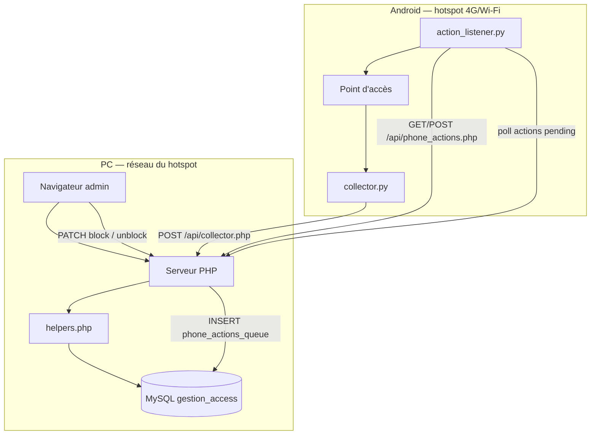
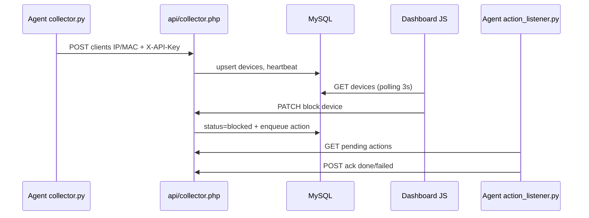

# Gestion_Access — Monitor_Ω

**Projet L3** — Système de surveillance de réseau avec tableau de bord  
**Auteur** — Jeremie BOKOTA  
**Dépôt** — https://github.com/davidng09/Gestion_Access

Monitor_Ω est une application web qui permet à un administrateur de **surveiller et gérer les accès Wi-Fi** d'un réseau local. Le dashboard tourne sur un **PC** ; la collecte des appareils connectés est assurée par un **agent Python** sur **Android** (Termux), via le hotspot du téléphone.

---

## Sommaire

1. [Vue d'ensemble](#vue-densemble)
2. [Architecture](#architecture)
3. [Outils requis](#outils-requis)
4. [Structure du projet](#structure-du-projet)
5. [Installation PC](#installation-pc)
6. [Configuration](#configuration)
7. [Installation mobile (agent Android)](#installation-mobile-agent-android)
8. [Premiers tests](#premiers-tests)
9. [API REST](#api-rest)
10. [Base de données](#base-de-données)
11. [Roadmap](#roadmap)
12. [Dépannage](#dépannage)

---

## Vue d'ensemble

| Composant | Rôle |
|-----------|------|
| **Dashboard (PC)** | Interface admin : métriques, tableau Wi-Fi, journaux, block/unblock |
| **Backend PHP** | API REST, sessions, logique métier |
| **MySQL** | Persistance : appareils, métriques, file d'actions, heartbeats |
| **Agent Android** | Scan ARP du hotspot, envoi clients, exécution block/unblock |

Le projet ne repose **plus sur des données simulées** : les appareils apparaissent uniquement après collecte réelle (agent ou `curl` de test).

---

## Architecture

### Schéma global



### Flux de données



### Séparation des accès

| Zone | Authentification | Endpoints |
|------|------------------|-----------|
| **Admin** | Session PHP (cookie) | `auth.php`, `devices.php`, `metrics.php`, `logs.php`, `agent.php` |
| **Agent** | Header `X-API-Key` + filtre IP hotspot | `collector.php`, `phone_actions.php` |

### Stack technique

| Couche | Technologie |
|--------|-------------|
| Front | HTML5, Tailwind CSS (CDN), JavaScript ES modules |
| Back | PHP 8.x, sessions, PDO |
| BDD | MySQL 8 / MariaDB (`gestion_access`) |
| Agent mobile | Python 3, Termux, `requests` |
| Serveur dev | XAMPP (Apache + MySQL) ou `php -S` |
| Polices / icônes | Inter, JetBrains Mono, Material Symbols |

---

## Outils requis

### Sur le PC

| Outil | Usage | Lien |
|-------|-------|------|
| **XAMPP** | Apache + MySQL + PHP | https://www.apachefriends.org/ |
| **PHP CLI** | `database/install.php`, serveur intégré | Inclus dans XAMPP |
| **Navigateur** | Dashboard admin | Chrome, Firefox, Edge |
| **curl** ou PowerShell | Tests API | Inclus Windows 10+ |
| **Git** | Cloner / mettre à jour le projet | https://git-scm.com/ |

### Sur le mobile

| Outil | Usage | Lien |
|-------|-------|------|
| **Termux** | Terminal Android pour l'agent | https://termux.dev/ |
| **Python 3** | Exécution `collector.py` / `action_listener.py` | `pkg install python` |
| **Hotspot Android** | Réseau local PC + clients Wi-Fi | Paramètres téléphone |

---

## Structure du projet

```
Gestion_Access/
├── index.php, login.php, logout.php     # Pages web
├── config/
│   ├── database.php                     # Connexion MySQL
│   ├── agent.php                        # Config agent (défauts)
│   └── agent.local.php.example          # Modèle config locale
├── api/
│   ├── auth.php                         # Login JSON
│   ├── devices.php                      # CRUD appareils (admin)
│   ├── metrics.php                      # Métriques réseau
│   ├── logs.php                         # Journal d'activité
│   ├── collector.php                    # Ingestion clients (agent)
│   ├── phone_actions.php                # File block/unblock (agent)
│   └── agent.php                        # Statut heartbeat (admin)
├── includes/
│   ├── session.php, auth_guard.php
│   ├── helpers.php                      # Logique métier centrale
│   └── partials/                        # Composants HTML
├── database/
│   ├── schema.sql, seed.sql
│   ├── migration_phone_agent.sql
│   ├── install.php, create_admin.php
│   └── test_connection.php
├── agent-android/
│   ├── collector.py                     # Scan ARP → POST PC
│   ├── action_listener.py               # Poll + exécute actions
│   ├── block_no_root.py, block_root.py
│   ├── config.example.ini
│   └── requirements.txt
└── assets/
    ├── css/dashboard.css
    └── js/                              # SPA : api, dashboard, navigation, app
```

---

## Installation PC

### 1. Cloner le projet

```powershell
git clone https://github.com/davidng09/Gestion_Access.git
cd Gestion_Access
```

Ou placez le dossier dans `C:\xampp\htdocs\Gestion_Access`.

### 2. Démarrer MySQL

Ouvrez **XAMPP** → démarrez **MySQL** (et **Apache** si vous utilisez `htdocs`).

### 3. Créer la base

```powershell
cd "C:\chemin\vers\Gestion_Access"
php database/install.php
```

Alternative MySQL CLI :

```powershell
C:\xampp\mysql\bin\mysql.exe -u root < database\schema.sql
C:\xampp\mysql\bin\mysql.exe -u root < database\seed.sql
```

**Base déjà existante** (mise à jour) :

```powershell
C:\xampp\mysql\bin\mysql.exe -u root gestion_access < database\migration_phone_agent.sql
C:\xampp\mysql\bin\mysql.exe -u root gestion_access < database\seed.sql
```

### 4. Vérifier

```powershell
php database/test_connection.php
```

Attendu : `auth_ok=yes` et `devices=0`.

### 5. Lancer le serveur

**Mode hotspot (recommandé pour l'agent mobile)** :

```powershell
php -S 0.0.0.0:8080
```

**Mode XAMPP** :

```
http://localhost/Gestion_Access/login.php
```

### 6. Connexion admin

| Identifiant | Mot de passe |
|-------------|--------------|
| `jeremie` | `admin123` |

Réinitialiser l'admin : `php database/create_admin.php`

---

## Configuration

### `config/database.php`

Valeurs par défaut XAMPP :

```php
$dsn = 'mysql:host=127.0.0.1;dbname=gestion_access;charset=utf8mb4';
// utilisateur : root, mot de passe : (vide)
```

### `config/agent.local.php` (à créer)

```powershell
copy config\agent.local.php.example config\agent.local.php
```

Contenu recommandé pour les **premiers tests** :

```php
<?php

declare(strict_types=1);

return [
    'api_key' => 'gestion-access-dev-key-change-me',
    'hotspot_subnet' => '*',
    'device_stale_seconds' => 30,
    'rate_limit_seconds' => 1,
];
```

| Clé | Description |
|-----|-------------|
| `api_key` | Clé partagée PC ↔ téléphone (header `X-API-Key`) |
| `hotspot_subnet` | Sous-réseau autorisé (`192.168.43.0/24`) ou `*` pour tout |
| `device_stale_seconds` | Délai avant marquer un appareil hors ligne |
| `rate_limit_seconds` | Anti-spam sur `collector.php` |

> `config/agent.local.php` est ignoré par Git (secrets locaux).

### Pare-feu Windows (port 8080)

PowerShell **en administrateur** :

```powershell
New-NetFirewallRule -DisplayName "Gestion_Access PHP 8080" -Direction Inbound -Protocol TCP -LocalPort 8080 -Action Allow
```

---

## Installation mobile (agent Android)

### 1. Réseau

1. Activez le **hotspot Wi-Fi** sur le téléphone.
2. Connectez le **PC au Wi-Fi du téléphone**.
3. Sur le PC, notez l'IPv4 : `ipconfig` → ex. `192.168.43.10`.

### 2. Termux

```bash
pkg update -y && pkg install -y python
pip install requests
```

Copiez le dossier `agent-android/` sur le téléphone, puis :

```bash
cd ~/chemin/vers/agent-android
cp config.example.ini config.ini
nano config.ini
```

### 3. `config.ini` (copier-coller)

```ini
[agent]
pc_url = http://192.168.43.10:8080
api_key = gestion-access-dev-key-change-me
scan_interval = 10
poll_interval = 5
agent_id = android-collector
```

Remplacez `192.168.43.10` par l'**IP du PC** sur le hotspot.

### 4. Lancer les agents

**Terminal 1 — collecte :**

```bash
python collector.py
```

**Terminal 2 — actions :**

```bash
python action_listener.py
```

Voir aussi [`agent-android/README.md`](agent-android/README.md).

---

## Premiers tests

### Niveau 1 — Base de données (PC seul)

```powershell
php database/test_connection.php
php database/test_api_logic.php
```

### Niveau 2 — API collector (PC seul, sans téléphone)

Serveur lancé : `php -S 0.0.0.0:8080`

```powershell
curl -X POST http://127.0.0.1:8080/api/collector.php `
  -H "Content-Type: application/json" `
  -H "X-API-Key: gestion-access-dev-key-change-me" `
  -d "{\"clients\":[{\"ip\":\"192.168.43.50\",\"mac\":\"AA:BB:CC:DD:EE:01\",\"hostname\":\"Test_PC\"}]}"
```

Puis : `http://localhost:8080/login.php` → onglet **Wi-Fi** → appareil **Test_PC** badge **Réel**.

### Niveau 3 — Agent Android complet

| Étape | Action | Résultat attendu |
|-------|--------|------------------|
| 1 | Hotspot ON, PC connecté | Les deux sur le même sous-réseau |
| 2 | `php -S 0.0.0.0:8080` sur PC | Serveur accessible depuis le téléphone |
| 3 | `collector.py` + `action_listener.py` | Logs `client(s) envoyé(s)` |
| 4 | Dashboard → Accueil | Carte **Agent Android** = Connecté |
| 5 | Dashboard → Wi-Fi | Clients du hotspot listés |
| 6 | Clic **Bloquer** | Entrée `pending` dans `phone_actions_queue` |
| 7 | `action_listener.py` | Action acquittée `done` |
| 8 | Clic **Débloquer** | Statut `authorized` restauré |

### Test depuis Termux (connectivité PC)

```bash
curl -X POST http://192.168.43.10:8080/api/collector.php \
  -H "Content-Type: application/json" \
  -H "X-API-Key: gestion-access-dev-key-change-me" \
  -d '{"clients":[{"ip":"192.168.43.99","mac":"DE:AD:BE:EF:00:99","hostname":"Test_Termux"}]}'
```

---

## API REST

### Routes admin (session requise)

| Méthode | Endpoint | Description |
|---------|----------|-------------|
| POST | `api/auth.php?action=login` | Connexion |
| GET | `api/devices.php` | Liste des appareils |
| PATCH | `api/devices.php?id={id}` | Toggle `{ "is_online": true/false }` |
| PATCH | `api/devices.php?id={id}` | Block `{ "action": "block" }` |
| PATCH | `api/devices.php?id={id}` | Unblock `{ "action": "unblock" }` |
| GET | `api/metrics.php` | Métriques réseau |
| GET | `api/logs.php?limit=50` | Journal d'activité |
| GET | `api/agent.php` | Statut agent Android |

### Routes agent (`X-API-Key` requise)

| Méthode | Endpoint | Description |
|---------|----------|-------------|
| POST | `api/collector.php` | Envoi liste clients |
| GET | `api/phone_actions.php?status=pending` | Actions à exécuter |
| POST | `api/phone_actions.php` | Acquittement `{ "action_id", "status": "done" }` |

**Exemple collector :**

```json
{
  "agent_id": "android-collector",
  "clients": [
    { "ip": "192.168.43.50", "mac": "AA:BB:CC:DD:EE:01", "hostname": "Mon_PC" }
  ]
}
```

---

## Base de données

### Tables actives

| Table | Rôle |
|-------|------|
| `admins` | Comptes administrateurs |
| `devices` | Appareils Wi-Fi (`data_source = real`) |
| `network_metrics` | Vue agrégée réseau (1 ligne) |
| `activity_logs` | Timeline des événements |
| `phone_actions_queue` | File block/unblock pour l'agent |
| `agent_heartbeats` | Dernier signal du collector |

### Tables réservées (évolutions futures)

| Table | Rôle prévu |
|-------|------------|
| `traffic_history` | Historique trafic pour graphiques |
| `observability_sources` / `observability_metrics` | Intégration Zabbix, Prometheus, etc. |

---

## Roadmap

### Phase 1 — Fonctionnel (actuel)

- [x] Dashboard SPA (Accueil, Wi-Fi, Santé, Journaux, Admin)
- [x] Auth admin par session PHP
- [x] Collecte réelle via agent Android (ARP)
- [x] File d'actions block/unblock
- [x] Heartbeat agent + carte statut
- [x] Blocage logique sans root

### Phase 2 — Tests & soutenance

- [ ] Tests bout en bout PC + mobile documentés
- [ ] Clé API personnalisée en production (`agent.local.php`)
- [ ] Sous-réseau hotspot verrouillé (retirer `*`)
- [ ] Scénario de démo répétable (checklist imprimable)

### Phase 3 — Renforcement réseau

- [ ] Blocage iptables avec root Android (`block_root.py`)
- [ ] Métriques trafic réelles (lecture `/proc/net/dev` côté agent)
- [ ] Détection type d'appareil améliorée (hostname, OUI MAC)
- [ ] Notification push ou SMS sur alerte

### Phase 4 — Production & supervision

- [ ] Déploiement Apache/Nginx (HTTPS, certificat)
- [ ] Intégration observability (Prometheus, Grafana)
- [ ] Export CSV/PDF des journaux
- [ ] Multi-admins et rôles granulaires
- [ ] Graphique Chart.js sur `traffic_history`

### Phase 5 — Évolutions avancées

- [ ] Agent iOS (limitations réseau à étudier)
- [ ] API WebSocket pour temps réel sans polling
- [ ] Déploiement Docker (PHP + MySQL)
- [ ] SNMP pour équipements réseau fixes

---

## Dépannage

| Problème | Solution |
|----------|----------|
| `ERROR 2002` MySQL | Démarrer MySQL dans XAMPP |
| `Identifiants invalides` | `php database/create_admin.php` ou réimporter `seed.sql` |
| `401` agent | Aligner `api_key` PC (`agent.local.php`) et mobile (`config.ini`) |
| `403 IP non autorisée` | `hotspot_subnet = '*'` ou ajuster le masque |
| `Connection refused` | `php -S 0.0.0.0:8080`, pas `127.0.0.1` seul côté agent |
| Tableau Wi-Fi vide | Lancer `collector.py` ou test curl niveau 2 |
| Aucun client ARP | Ping PC ↔ téléphone pour remplir `/proc/net/arp` |
| JS ne charge pas | Servir via `http://`, jamais `file://` |
| API admin `401` | Se reconnecter via `login.php` |

---

## Contexte académique

Projet réalisé dans le cadre d'un module **L3** — système de surveillance de réseau avec tableau de bord. L'architecture sépare clairement la **couche présentation** (dashboard), la **couche métier** (PHP/MySQL) et la **couche collecte** (agent mobile), ce qui permet une évolution progressive vers un déploiement réel.

---

## Licence

Projet académique — usage libre pour apprentissage et démonstration.
