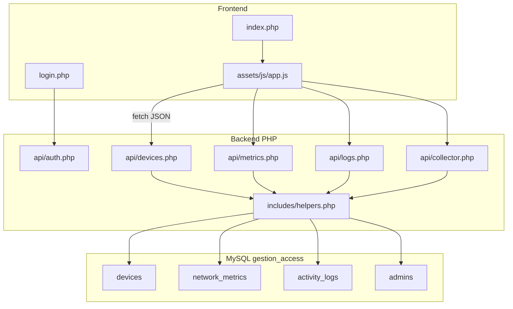

# Gestion_Access — Monitor_Ω

**Sujet L3 :** Système de surveillance de réseau avec tableau de bord  
**Objectif :** Permettre à un administrateur de surveiller en temps réel les performances d'un réseau via un tableau de bord simple et interactif.

Application web **HTML / CSS / JavaScript** (front) + **PHP / MySQL** (back), alimentée par l'**agent Android** (hotspot Termux) pour la collecte réelle des appareils Wi-Fi.

---

## Stack technique

| Couche | Technologie |
|--------|-------------|
| Front | HTML5, Tailwind CSS (CDN), JavaScript ES modules |
| Back | PHP 8.x, sessions, PDO |
| BDD | MySQL (`gestion_access`) |
| Serveur local | XAMPP (Apache + MySQL) |
| Polices | Inter, JetBrains Mono, Material Symbols |

---

## Prérequis

- [XAMPP](https://www.apachefriends.org/) (ou équivalent : Apache + PHP 8+ + MySQL)
- Navigateur moderne (Chrome, Firefox, Edge)
- PHP en ligne de commande (optionnel, pour `database/install.php`)

---

## Installation pas à pas

### 1. Copier le projet

Placez le dossier `Gestion_Access` dans le répertoire web de XAMPP :

```
C:\xampp\htdocs\Gestion_Access\
```

### 2. Démarrer XAMPP

- Lancez le **panneau de contrôle XAMPP**
- Démarrez **Apache** et **MySQL**

### 3. Créer la base de données

**Option A — phpMyAdmin**

1. Ouvrez `http://localhost/phpmyadmin`
2. Importez [`database/schema.sql`](database/schema.sql)
3. Importez [`database/seed.sql`](database/seed.sql)

**Option B — Ligne de commande**

```bash
cd C:\xampp\htdocs\Gestion_Access
php database/install.php
```

**Option C — MySQL CLI**

```bash
C:\xampp\mysql\bin\mysql.exe -u root < database/schema.sql
C:\xampp\mysql\bin\mysql.exe -u root < database/seed.sql
```

**Option D — Base existante (migration agent Android)**

Si la base est déjà créée, exécutez en plus :

```bash
C:\xampp\mysql\bin\mysql.exe -u root gestion_access < database/migration_phone_agent.sql
```

### 4. Configuration base de données

Fichier [`config/database.php`](config/database.php) — valeurs par défaut XAMPP :

| Paramètre | Valeur |
|-----------|--------|
| Host | `127.0.0.1` |
| Base | `gestion_access` |
| Utilisateur | `root` |
| Mot de passe | *(vide)* |

Modifiez ce fichier si votre installation MySQL utilise un autre mot de passe.

### 5. Configuration agent Android (optionnel)

Fichier [`config/agent.php`](config/agent.php) — valeurs par défaut :

| Paramètre | Valeur | Description |
|-----------|--------|-------------|
| `api_key` | `gestion-access-dev-key-change-me` | Clé partagée PC ↔ téléphone |
| `hotspot_subnet` | `192.168.43.0/24` | Sous-réseau hotspot autorisé (`*` = tout) |
| `device_stale_seconds` | `30` | Délai avant marquer un appareil réel hors ligne |

Pour la production, copiez [`config/agent.local.php.example`](config/agent.local.php.example) vers `config/agent.local.php` et changez la clé API.

### 6. Accéder à l'application

| Page | URL |
|------|-----|
| Connexion | `http://localhost/Gestion_Access/login.php` |
| Dashboard | `http://localhost/Gestion_Access/index.php` |

---

## Comptes démo

| Identifiant | Mot de passe | Profil |
|-------------|--------------|--------|
| `jeremie` | `admin123` | Jeremie BOKOTA — Administrateur Niveau 4 |

Créer/réinitialiser l'admin : `php database/create_admin.php`

---

## Intégration Android Hotspot (données réelles)

### Schéma réseau

```
[Téléphone Android — hotspot 4G]
        │
        ├── PC (dashboard PHP/MySQL)  →  http://IP_PC:8080
        └── Clients Wi-Fi détectés via ARP
```

1. Le téléphone active le **hotspot Wi-Fi**
2. Le PC se connecte au Wi-Fi du téléphone
3. L'agent Termux (`agent-android/`) envoie les clients au PC
4. L'admin bloque/débloque depuis le dashboard ; l'agent exécute les actions

### Lancement serveur (PC sur hotspot)

```bash
php -S 0.0.0.0:8080 -t "C:\chemin\vers\Gestion_Access"
```

Utilisez `0.0.0.0` (pas `localhost`) pour accepter les connexions depuis le téléphone.

### Agent Termux

Voir le guide détaillé : [`agent-android/README.md`](agent-android/README.md)

```bash
pkg install python
pip install -r requirements.txt
cp config.example.ini config.ini
# Éditer pc_url (IP du PC) et api_key
python collector.py        # session 1
python action_listener.py  # session 2
```

### Test rapide sans téléphone (curl)

```bash
curl -X POST http://127.0.0.1:8080/api/collector.php ^
  -H "Content-Type: application/json" ^
  -H "X-API-Key: gestion-access-dev-key-change-me" ^
  -d "{\"clients\":[{\"ip\":\"192.168.43.50\",\"mac\":\"AA:BB:CC:DD:EE:01\",\"hostname\":\"Test_PC\"}]}"
```

L'appareil apparaît dans le tableau Wi-Fi avec le badge **Réel**. La carte **Agent Android** sur l'accueil affiche l'état de connexion.

### Blocage sans root vs avec root

| Mode | Comportement |
|------|--------------|
| Sans root (défaut) | Statut bloqué en BDD + log agent ; suffisant pour la soutenance |
| Avec root (option) | Règle `iptables` en plus via `block_root.py` |

---

## Structure des dossiers

```
Gestion_Access/
├── index.php                 # Dashboard SPA (protégé par session)
├── login.php                 # Page de connexion
├── logout.php                # Déconnexion
├── Prototype.html            # Référence design (statique)
├── README.md                 # Ce fichier
├── config/
│   ├── database.php          # Connexion PDO MySQL
│   ├── agent.php             # Config agent Android (clé API, sous-réseau)
│   └── agent.local.php.example
├── agent-android/            # Scripts Termux (collector, action_listener)
│   ├── collector.py
│   ├── action_listener.py
│   └── README.md
├── includes/
│   ├── session.php           # Gestion sessions PHP
│   ├── auth_guard.php        # Redirection si non connecté
│   ├── helpers.php           # Logique métier partagée
│   └── partials/             # Composants HTML réutilisables
├── api/
│   ├── auth.php              # Authentification JSON
│   ├── devices.php           # Liste / toggle / block / unblock appareils
│   ├── metrics.php           # Métriques réseau
│   ├── logs.php              # Timeline d'activité
│   ├── collector.php         # Ingestion clients depuis Android (X-API-Key)
│   ├── phone_actions.php     # File block/unblock pour l'agent
│   └── agent.php             # Statut heartbeat agent (session admin)
├── database/
│   ├── schema.sql            # Structure des tables
│   ├── seed.sql              # Données initiales
│   ├── migration_phone_agent.sql  # Migration bases existantes
│   └── install.php           # Script d'installation CLI
└── assets/
    ├── css/dashboard.css     # Styles custom (animations, scrollbar)
    └── js/
        ├── config.js         # URL API, intervalle polling
        ├── api.js            # Appels fetch
        ├── ui.js             # Toasts, badges, icônes
        ├── dashboard.js      # Rendu widgets, tableau, logs
        ├── navigation.js     # Navigation SPA (6 vues)
        └── app.js            # Point d'entrée
```

---

## Architecture



**Flux toggle appareil :** JavaScript `PATCH api/devices.php` → PHP met à jour `devices` → `recalcMetrics()` → `logEvent()` → le front recharge métriques, tableau et logs.

---

## Schéma base de données

### Tables

| Table | Description |
|-------|-------------|
| `admins` | Administrateurs simulés |
| `devices` | Appareils Wi-Fi détectés par l'agent (`data_source`: real) |
| `network_metrics` | État global du réseau (1 ligne, `id = 1`) |
| `activity_logs` | Journal chronologique (timeline) |
| `phone_actions_queue` | File d'actions block/unblock pour l'agent Android |
| `agent_heartbeats` | Dernier signal de l'agent collector |

### Relations

- `activity_logs.device_id` → `devices.id` (ON DELETE SET NULL)

### Énumérations

**devices.status** : `authorized` | `inactive` | `blocked` | `guest`  
**devices.device_type** : `laptop` | `mobile` | `desktop` | `unknown`  
**devices.data_source** : `real` (appareils issus du collector Android)  

### Données initiales (seed)

- Admin `jeremie` / `admin123`
- Aucun appareil préchargé — les clients apparaissent via l'agent Android ou `POST /api/collector.php`
- Métriques réseau à zéro jusqu'à la première collecte

---

## API REST (JSON)

Toutes les routes admin exigent une **session PHP** active. Les routes agent (`collector.php`, `phone_actions.php`) utilisent `X-API-Key`.

### `GET api/metrics.php`

```json
{
  "network_status": "online",
  "active_users": 0,
  "laptops_count": 0,
  "mobile_count": 0,
  "traffic_mbps": 0,
  "traffic_up_mbps": 0,
  "traffic_down_mbps": 0,
  "alert_active": false
}
```

### `GET api/logs.php?limit=50`

Tableau d'entrées `{ id, event_time, event_type, message, severity, device_id }`.

---

## Cas d'usage

| ID | Scénario | Étapes | Résultat attendu |
|----|----------|--------|------------------|
| UC-01 | Connexion admin | `login.php` → jeremie / admin123 | Session créée, redirect dashboard |
| UC-02 | Chargement dashboard | Ouvrir `index.php` | Cartes, tableau et logs chargés depuis l'API |
| UC-03 | Collecte réelle | POST `collector.php` depuis agent/curl | Appareil badge **Réel**, carte agent connectée |
| UC-04 | Désactiver appareil | Toggle OFF sur un client | Compteur -1, log timeline |
| UC-05 | Bloquer accès | Clic Bloquer | `status=blocked`, file d'actions, log sécurité |
| UC-06 | Débloquer appareil | Clic Débloquer | `status=authorized`, file unblock |
| UC-07 | Recherche | Saisir IP ou MAC dans Search | Filtre le tableau (client) |
| UC-08 | Déconnexion | Admin → Déconnexion | Redirect login, `index.php` inaccessible |

---

## Fonctionnalités front

- **SPA** : 5 vues via la sidebar (Accueil, Wi-Fi, Santé, Journaux, Admin)
- **Tableau Wi-Fi** : toggle, block, débloquer, badge **Réel**
- **Recherche** : filtre hostname, IP, MAC
- **Timeline** : logs en temps réel, polling toutes les 3 secondes
- **Agent Android** : carte de statut sur l'accueil
- **Persistance** : toutes les actions survivent au rechargement (F5)

---

## Guide de démo (soutenance)

1. Ouvrir `login.php` — se connecter (`jeremie` / `admin123`)
2. **Accueil** — présenter les cartes réseau et la carte **Agent Android**
3. **Wi-Fi** — montrer le tableau et les badges **Réel**
4. **Collecte** — lancer l'agent Termux ou le test curl ; vérifier l'apparition des clients
5. **Toggle** — désactiver un appareil (compteur et log mis à jour)
6. **Block / Débloquer** — bloquer puis débloquer un appareil (file d'actions côté agent)
7. **F5** — vérifier la persistance en base
8. **Admin** — déconnexion

---

## Tests de validation

| Test | Action | Attendu |
|------|--------|---------|
| T1 | F5 après Block | Appareil reste `blocked` |
| T2 | Toggle appareil OFF/ON | Compteur cohérent avec BDD |
| T3 | Accès `index.php` sans login | Redirect vers `login.php` |
| T4 | Appel API admin sans session | HTTP 401 JSON |
| T5 | POST collector.php (curl) | Appareil `data_source=real` en BDD |
| T6 | Block appareil réel | Entrée `pending` dans `phone_actions_queue` |

**Test connexion BDD (CLI) :**

```bash
php database/test_connection.php
```

Attendu : `auth_ok=yes` et `devices=0` (jusqu'à collecte agent).

---

## Dépannage

| Problème | Solution |
|----------|----------|
| `Erreur base de données` / PDO | Vérifier que MySQL est démarré dans XAMPP |
| Page blanche | Activer `display_errors` dans `php.ini` ou consulter `apache/logs/error.log` |
| `Identifiants invalides` | Réimporter `seed.sql` ou exécuter `php database/install.php` |
| API 401 | Se reconnecter via `login.php` (session expirée) |
| Modules JS ne chargent pas | Utiliser Apache (`localhost/...`), pas `file://` |
| `CORS` / fetch échoue | Servir le projet via `http://localhost/Gestion_Access/` |
| Mot de passe MySQL non vide | Modifier `config/database.php` |
| MySQL arrêté (ERROR 2002) | Démarrer MySQL dans le panneau XAMPP |
| Agent 403 IP non autorisée | Ajuster `hotspot_subnet` ou `*` dans `config/agent.local.php` |
| Agent 401 | Aligner `api_key` entre `config/agent.php` et `agent-android/config.ini` |

---

## Évolutions possibles (hors scope)

- Graphique Chart.js + `traffic_history`
- Export CSV des logs
- Intégration SNMP / Prometheus réels

---

## Licence / contexte académique

Projet réalisé dans le cadre d'un module L3 — gestion et surveillance d'accès réseau via hotspot Android et collecte réelle des clients Wi-Fi.
